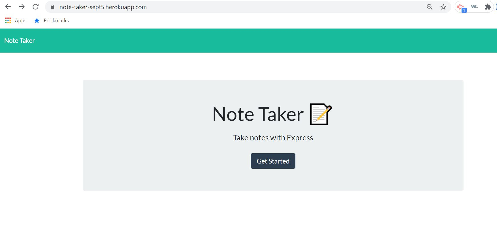
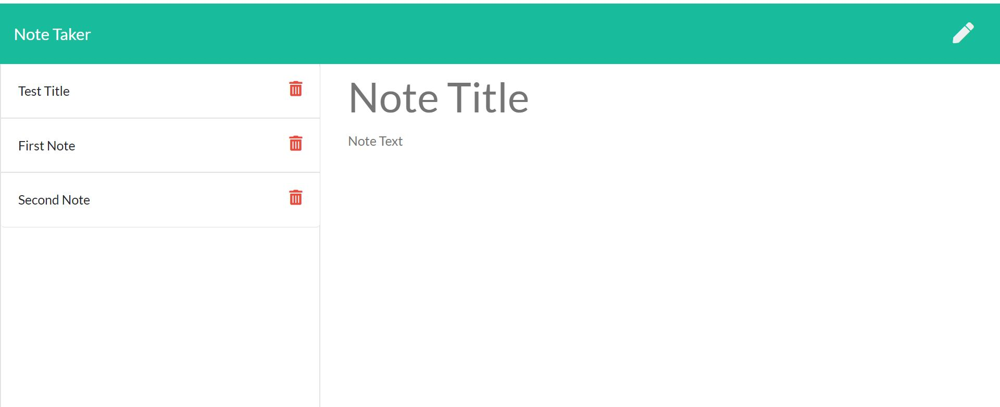
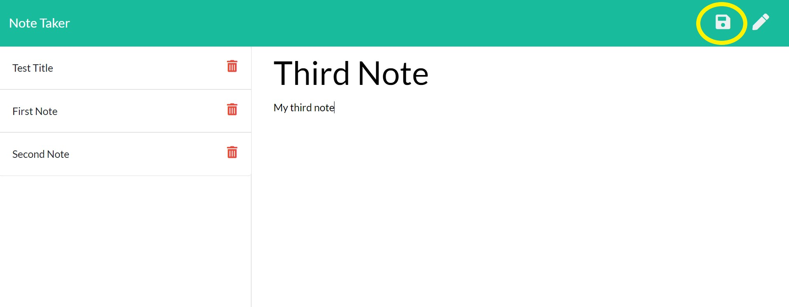

# noteTaker
## Description
Created this application that can be used to write, save, and delete notes. This application will use an express backend and it saves and retrieves note data from a JSON file. The application frontend has already been created, I have developed the backend and connected the two.
## Table of Contents
* [Installation](#installation)
* [Usage](#usage)
* [License](#license)
* [Contributing](#contributing)
* [Tests](#tests)
* [Questions](#questions)
## Installation
This application is located at GitHub at https://github.com/vkalaparthy/noteTaker and it is deployed at https://note-taker-sept5.herokuapp.com/.  This application has 2 html routes and api routes to access JSON file and make modifications to the saved notes.
## Usage
Users can create the notes, save them and view the notes that were written before.  This application can also delete the notes.  For the convenience, this application does not let user create notes with same "Note Title".  The starting page of application screen

When you click on "Get Started", you will be able to see your saved Notes, you can either add more notes view the notes and delete the notes from this page.

Type the note infomation you want to add and click save (as circled icon in the below screenshot. This will appear as saved Notes in the column.

## License.
## Contributing
## Tests

## Questions
* Vani Kalaparthy
  * https://github.com/vkalaparthy
  * kalaparthy.vani@gmail.com
