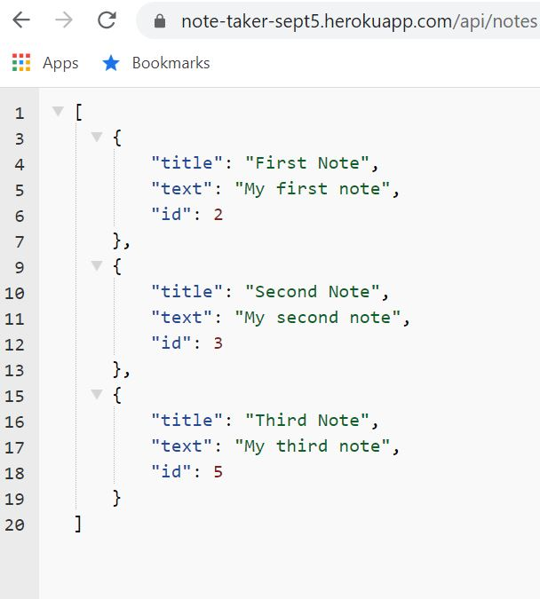

# noteTaker
Read, write, delete and save notes to get organized.

## Table of Contents
* [General Info](#general-info)
* [Technologies](#technologies)
* [Installation](#installation)
* [How to Use](#usage)
* [Contact](#contact)

## General Info 
This application is used to keep you well organized as it helps you view the previously saved notes and helps you create & delte notes.

## Technologies
* HTML
* CSS
* JSON file
* EXPRESS

## Installation
This application is located at GitHub at https://github.com/vkalaparthy/noteTaker and it is deployed at https://note-taker-sept5.herokuapp.com/.  This application has 2 html routes and api routes to access JSON file and make modifications to the saved notes.

## How to Use
Users can create the notes, save them and view the notes that were written before.  This application can also delete the notes.  For the convenience, this application does not let user create notes with same "Note Title".  The starting page of application screen

When you click on "Get Started", you will be able to see your saved Notes, you can either add more notes view the notes and delete the notes from this page.

Type the note infomation you want to add and click save (as circled icon in the below screenshot. This will appear as saved Notes in the column.

There is a API route supported for this application at api/notes.

## Contact
* Vani Kalaparthy
  * https://github.com/vkalaparthy
  * kalaparthy.vani@gmail.com
